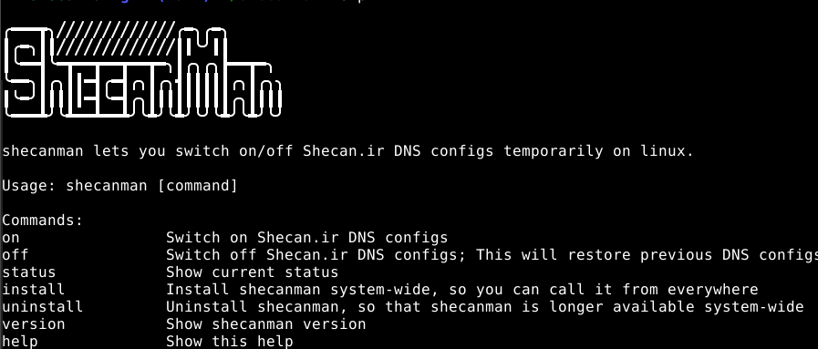

# ShecanMan

A simple lightweight utility script to use [Shecan](https://www.shecan.ir) DNS servers temporarily on Linux.



## Download

```shell script
curl -L -O https://github.com/amirz98/shecanman/releases/latest/download/shecanman
chmod +x shecanman
```

## Installation

**Installation is optional**, but lets ShecanMan to be accessible from everywhere:

```shell script
sudo bash shecanman install
```

If you don't want to access ShecanMan system-wide, you can continue using it locally.

## Usage

ShecanMan lets you switch on/off Shecan.ir DNS configs temporarily on linux.

Usage: `shecanman [command]`

Commands:

- `on` - Switch on Shecan.ir DNS configs.
- `off` - Switch off Shecan.ir DNS. This will restore previous DNS configs.
- `status` - Show current status.
- `install` - Install ShecanMan system-wide, so you can use it everywhere.
- `uninstall` - Uninstall ShecanMan, so that ShecanMan is longer available system-wide.
- `version` - Show ShecanMan version.
- `help` - Show help.

## Disclaimer

I have nothing to do with [Shecan](https://www.shecan.ir) team!
